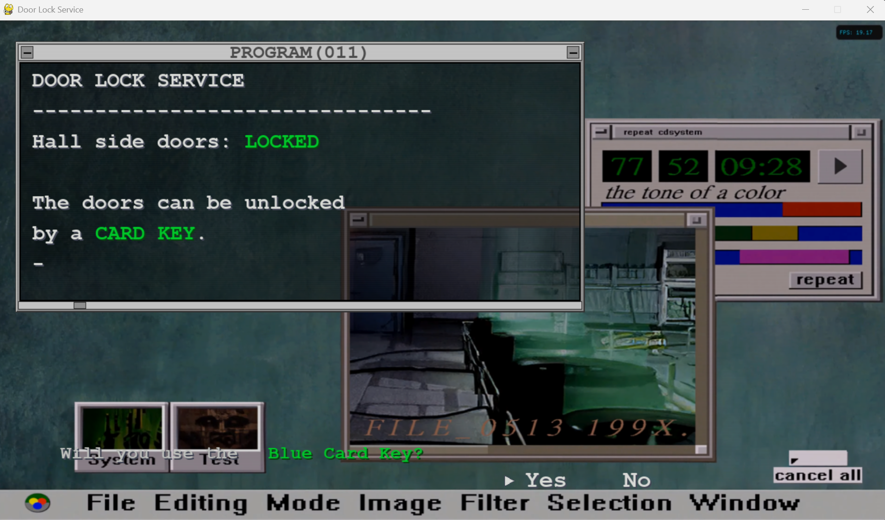
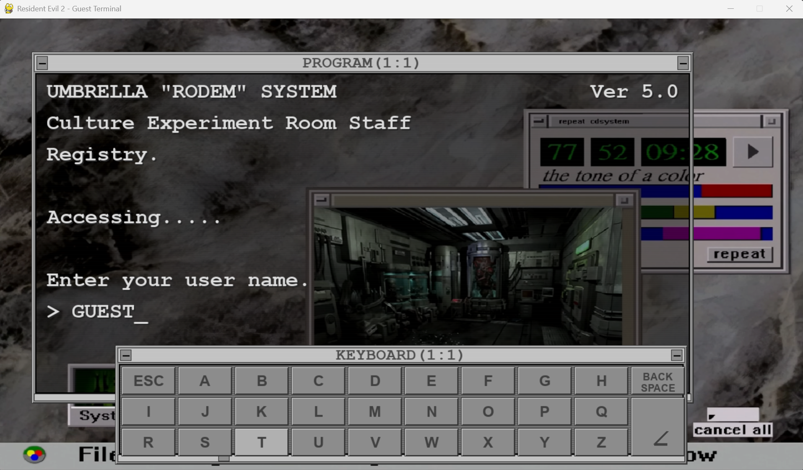
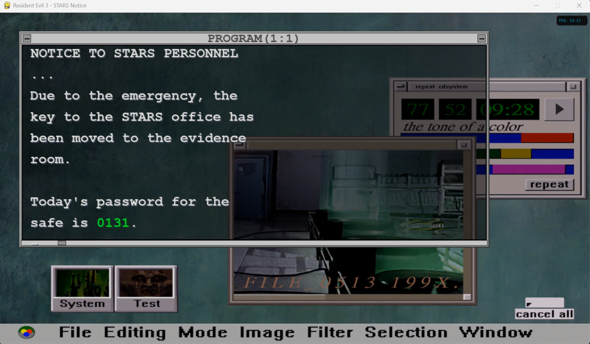
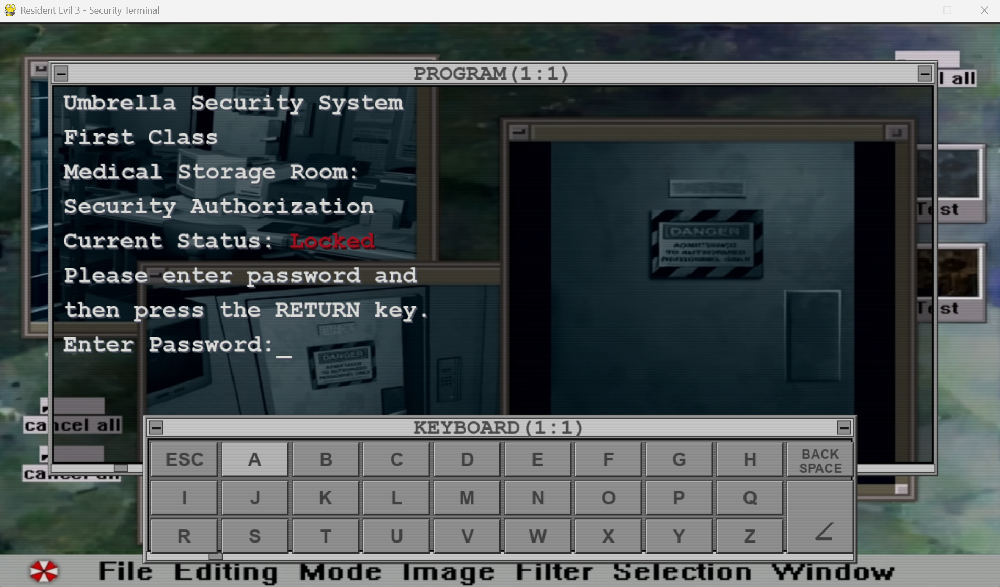

# re_terminals

A fun simulation inspired by *Resident evil 2 & 3* main PC access for unlock RPD doors.

## Mantenimiento y pruebas

Los cinco programas se ejecutan con `python nombre_del_script.py`, incluido
`python re1_lab.py`. Importar sus módulos no abre ventanas ni inicia el audio.
Para utilizarlos desde otro script, llama a `main()`; esta función inicializa
los recursos y garantiza `pygame.quit()` incluso si se produce un error.
Si utilizas `App` directamente, llama antes a `initialize_resources()` y
asegura la limpieza con `try/finally`.

Las imágenes y el vídeo se buscan junto a los scripts, independientemente del
directorio desde el que se ejecuten. Los fallos de esos recursos se propagan;
los sonidos ausentes o dañados y la falta de dispositivo de audio permiten
continuar en silencio, con un aviso en consola. `terminal_common.py` comparte
este comportamiento y la caché de líneas de pantalla entre las aplicaciones.

Para ejecutar las pruebas sin abrir ventanas ni reproducir sonido:

```powershell
.\wintel\Scripts\python.exe -B -m unittest discover -s tests -v
```

En otros entornos, usa `python -B -m unittest discover -s tests -v` con las
dependencias instaladas. Las pruebas cubren el acceso de RE1, la navegación de
Guest, las transiciones de audio, los recorridos sin audio de las cinco
aplicaciones, la importación sin efectos secundarios y la liberación de recursos
en caso de error. La reproducción audiovisual completa necesita comprobación
manual en un dispositivo real.

Las contraseñas y permisos son parte de la simulación del juego, no un sistema
de autenticación para proteger datos reales. La revisión del código propio no
equivale a una auditoría de vulnerabilidades de las dependencias instaladas.








---

## 🚀 Installation & Usage
### **1️⃣ Install Dependencies**
Make sure you have Python 3 installed, then install required packages:

```bash
sudo apt install -yqq python3-tk python3.10-venv

python3.10 -m venv test
source test/bin/activate
pip install -r requirements.txt
```
**Note**: Only tested in Ubuntu/Debian distros.


### **2️⃣ Run the Program**
`
python re2_skycard.py

python re3_notice.py

python re3_safsprin.py  
`

### **3️⃣ Deactivate Virtual Environment when finished**
`
deactivate
`

### Wintel usage
```powershell
python.exe -m venv wintel

Set-ExecutionPolicy -ExecutionPolicy RemoteSigned -Scope Process

.\wintel\Scripts\Activate.ps1

pip install -r requirements.txt

python re2_skycard.py

python re2_guest.py

python re3_notice.py

python re3_safsprin.py    
```
